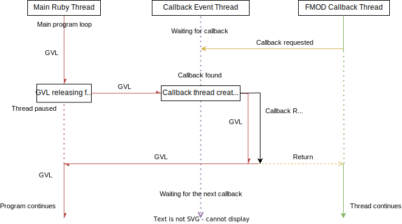

# libfmod
High level Ruby bindings to the FMOD and FMOD Studio libraries.

---

# General overview and important details

Functions will raise errors if FMOD does not return an `FMOD_OK` from a function. This is unlike the old ModShot FMOD bindings which returned the result of a function as the last return value. 
```rb
output1, output2, result = fmod.function # Does not work like this anymore!
# instead...
begin
    output1, output2 = fmod.function
rescue error
    puts error
end
```
The methodology behind this is to make errors more explicit when they happen. If you get an error and do not account for it, you will get a proper stack trace rather than some `noMethodError` that leaves you pulling your hair out figuring out why `bank` was `nil`. Programming in Rust has taught me to be explicit about failure, and this is a step closer to that.

These bindings won't handle garbage collection as you'd expect from Ruby. You will need to clean up after yourself.
Because of the way the bindings work as well calling the same function twice will **NOT** return the "same" object. Fundamentally, it is the same object, as the Rust side object is the same, but it is a brand new object as far as Ruby is concerned. It actually allocates a new Object that *points* to the same Rust side object, however the size of that Object is nonzero which means it is quite easy to leak memory with it.

Repeatedly using an object as a hash key or something will cause a memory leak because Ruby views each key as a different object.
i.e
```rb
hash = {}
100000.times do |i|
    hash[bank.get_event_list] = i # Bad will memory leak!
end
```

Luckily instances of objects from these bindings are very small so it's not a big deal if your code isn't perfect, but **PLEASE** do be mindful of this!
There is an `==` operator provided that will check if an object is the same for you as well.

The bindings should generally line up with what's documented in the latest FMOD docs- although some fucntions are aliased under more Ruby-like names too. 
The bindings are closest to the `C#` bindings for FMOD.

One other thing to note is that with return values you need to be mindful of method chaining as they do not behave like you would expect from Ruby.
When you call something like `get_3d_attributes`, you do not get a reference to the requested attribute. 
Instead, you get a *clone*, which will not modify the requested attribute. You will need to call the (usually provided) companion attribute that starts with `set` rather than `get`.
```rb
# will not work like you expect!
eventinstance.get_3d_attributes[1].up.x = 15
# will work!
struct = eventinstance.get_3d_attributes[1]
struct.up.x = 15
eventinstance.set_3d_attributes(struct)
```

# Structs/Classes

FMOD has a lot of structs, a lot of which have private fields (opaque structs). You cannot directly instantiate these with the exception of `System`.

However, there are some with public fields (Such as `Guid` or `Vector`). 
Each of those structs is actually respresented in Ruby by a `Struct`, which means you can instantiate them freely! 
You can even pass them to FMOD, provided all the fields are the correct type.

# Callbacks

Callbacks are queued and run in a Ruby event thread. The event thread spawns a new Ruby thread to run your callback. Callbacks block the FMOD callback thread until finished.

## Detailed explanation

See [this](https://www.burgestrand.se/articles/asynchronous-callbacks-in-ruby-c-extensions/) for a very 'detailed' information. 

Ruby has this nasty beast called the `GVL` which prevents Ruby code from being truly concurrent (Ractors are an exception). This library has to fight with the GVL and run your callbacks on Ruby's terms.

This has some interesting consequences. 

Because Ruby only runs 1 thread at a time, unless you initialize FMOD to not be async, your callbacks will not run the instant FMOD asks them to, and instead will be run whenever Ruby finds time to. (usually whenever the main thread calls a function that releases the GVL usually. If you use ModShot or mkxp-z, Graphics.update falls into this category.)
However, you *can* initialize FMOD to not be async, and it will run your callbacks during `System::update`. Your callbacks will be called faster but at the cost of 'blocking' the main thread.
This works because `System::update` is actually one of those special functions that releases the GVL, allowing other Ruby threads to run while the thread that called `System::update` is paused.

**If you are running async FMOD and your main thread never sleeps callbacks will be run very slowly, or not at all.**

Ractors do not really work to skirt around this problem. Callbacks would be run *inside* the Ractor and still have the same problem. Callbacks would need to run on a unique Ractor to solve this, and there is no way to do that in Ruby at the moment. Also, all your callbacks would be horribly gimped and hard to work with since you'd need to use a *lot* of message passing.
I've tried using Ractors at scale in other projects, and they are not fun to work with. Hopefully when they get stabilized these issues will be fixable, but until then, oh well.

If this **really** matters and you really need to use FMOD callbacks to manipulate sound data or something, why are you using Ruby in the first place??

## Diagram



# User data

Due to weird behavior and needing to satisfy the ruby garbage collector, user data is unsupported for now. I will return to it later.

---

I hope that's enough info to get you started!